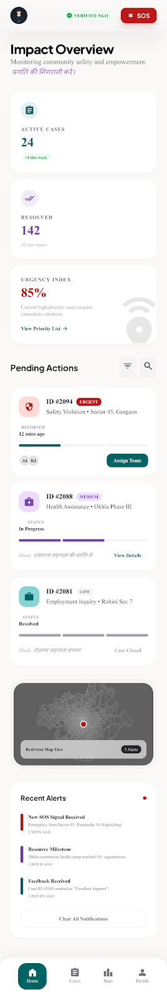
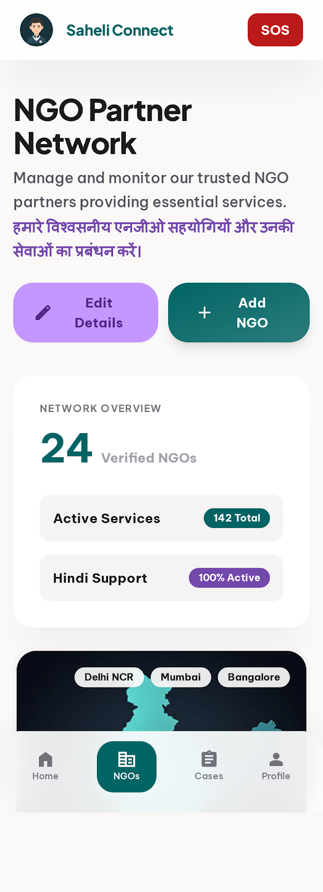
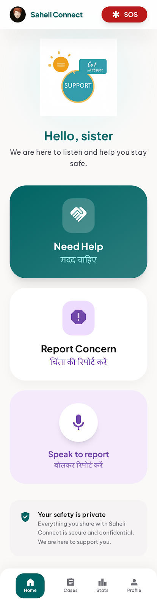

# 🌸 Saheli Connect

**Empowering Women, Bridging Gaps, Building Resilience.**

[](https://saheli-connect.vercel.app/)
[](https://saheliconnect.onrender.com)

**Saheli Connect** is a Social Support Coordination Platform designed to assist women in underserved areas. It bridges the critical gap between vulnerable individuals and social support services through smart routing, AI-driven prioritization, and an accessible reporting interface.

---

## 🚀 Live Link
Check out the platform here: **[saheli-connect.vercel.app](https://saheli-connect.vercel.app/)**

---

## ✨ Key Features

### 🏢 NGO Dashboard
A centralized hub for NGOs to manage cases, track progress, and coordinate with field workers.
- **Real-time Case Management**: View and update reported cases instantly.
- **Priority Labeling**: Automatically categorizes cases based on urgency (Urgent, Moderate, Low).

### 🤖 Smart AI Routing
Uses Natural Language Processing (NLP) to analyze incoming reports and route them to the most relevant NGO based on:
- **Category**: (e.g., Protection, Mental Health, Health & Hygiene, Skill Development).
- **Location**: Proximity-based matching for faster response.
- **Language**: Basic detection for local dialects/Romanized Hindi.

### 📝 Accessible Reporting
Seamless reporting flows for women in need:
- **WhatsApp/SMS Integration**: Powered by Twilio for offline accessibility.
- **Web Portal**: Simple, high-contrast UI for direct reporting.

### 📊 Impact Analytics
Visual representation of data to help NGOs and policymakers understand trends and allocate resources effectively.

---

## 📸 Visuals

<p align="center">
  
  
</p>

<p align="center">
  
  
</p>

---

## 🛠️ Tech Stack

### Frontend
- **Framework**: [React 19](https://react.dev/) + [Vite](https://vitejs.dev/)
- **Styling**: [Tailwind CSS 4](https://tailwindcss.com/)
- **Animations**: [Framer Motion](https://www.framer.com/motion/)
- **Maps**: [React Leaflet](https://react-leaflet.js.org/)
- **Icons**: [Lucide React](https://lucide.dev/)

### Backend
- **Framework**: [FastAPI](https://fastapi.tiangolo.com/)
- **Database**: [SQLAlchemy](https://www.sqlalchemy.org/) with SQLite/PostgreSQL
- **AI/NLP**: Custom Keyword-based Intent Classification
- **Rate Limiting**: [SlowAPI](https://github.com/laurentS/slowapi)

---

## 📦 Local Setup

### 1. Clone the repository
```bash
git clone https://github.com/snehapandit2006/SaheliConnect.git
cd SaheliConnect
```

### 2. Backend Setup
```bash
cd backend
python -m venv venv
source venv/bin/activate  # On Windows: venv\Scripts\activate
pip install -r requirements.txt
python main.py
```

### 3. Frontend Setup
```bash
cd frontend
npm install
npm run dev
```

---

## 🛡️ Security & Consent
- **Consent-Driven**: All reporting requires explicit user consent.
- **Data Isolation**: NGOs can only see cases assigned to them.
- **Privacy First**: Sensitive data is handled with care and encryption where applicable.

---

## 🤝 Contributing
We welcome contributions to make Saheli Connect even more impactful! Please fork the repo and submit a PR.

---

## 📄 License
This project is licensed under the MIT License.
